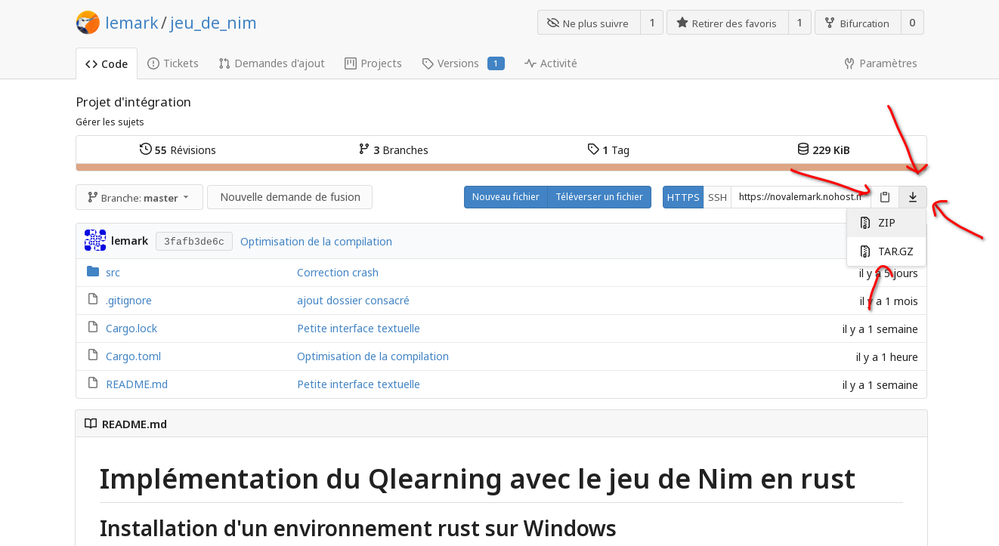

# Implémentation du Qlearning avec le jeu de Nim en rust
## Installation d'un environnement rust sur Windows
1. Aller sur https://www.rust-lang.org/tools/install et télécharger rustup-init.exe.
2. Exécuter rustup-init et choisir customize-installation pour changer le default host triple à x86_64-pc-windows-gnu (les autres paramètres peuvent être laissé à leur valeur par défaut).
3. Attendre que l'installation se complète.
4. Redémarrer l'ordinateur pour rafraichir le shell.

## Mise en route
1. Appuyer sur le bouton télécharger ce dépôt et sélectionner l'option zip.

2. Décompresser le .zip. 
3. Pour compiler et exécuter, il faut être à l'intérieur du dossier et exécuter dans cmd ou powershell.
```
cargo run --release
```

## Structure du code
Le code est réparti en trois fichiers importants: src/app.rs, src/qlearning.rs et src/qlearning/piles_et_action.rs.
### src/app.rs
C'est ici que se trouve l'interface où le code est attribué à des boutons.
### src/app/qlearning.rs
Contient l'implémentation du Qlearning.
### src/app/qlearning/piles_et_actions.rs
Est composé de plusieurs petits algorithmes relié aux structures piles et actions notamment l'algorithme xor-zéro et des algorithmes de choix d'actions.